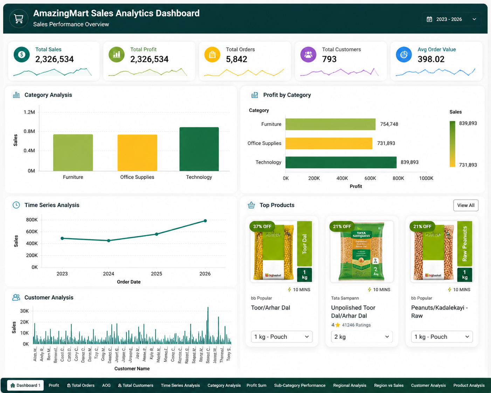

# 🛒 AmazingMart Sales Analytics Dashboard

## 📌 Project Overview

This project presents an interactive Sales Analytics Dashboard developed using Tableau. The dashboard analyzes AmazingMart sales data to provide insights into sales performance, profitability, customer behavior, product categories, regional performance, and business growth trends. It transforms raw transactional data into meaningful visualizations that support data-driven decision-making.

---

## 📷 Dashboard Preview

---

## 🎯 Business Objective

The objective of this dashboard is to analyze sales performance across different product categories, customer segments, and regions to identify growth opportunities and improve business decisions.

---

## 📊 Key Performance Indicators (KPIs)

- Total Sales
- Total Profit
- Total Customers
- Total Orders
- Average Order Value
- Category-wise Sales
- Regional Sales Performance

---

## 📈 Dashboard Insights

- Technology products generated the highest sales and profit.
- Sales performance varies across different product categories.
- Customer purchasing patterns can be analyzed through order history.
- Regional analysis helps identify high-performing markets.
- Time series analysis highlights yearly sales trends.
- Product-level insights help identify best-selling products.

---

## 🛠️ Tools & Technologies

- Tableau
- Microsoft Excel
- Data Cleaning
- Data Visualization
- Business Intelligence

---

## 📂 Dataset

The dashboard is built using the AmazingMart EU sales dataset containing:

- Order ID
- Order Date
- Customer Information
- Product Details
- Category & Sub-Category
- Region
- Sales
- Profit
- Quantity
- Discount

---

## 📌 Dashboard Features

- Interactive Dashboard
- Category Analysis
- Customer Analysis
- Product Analysis
- Profit Analysis
- Regional Analysis
- Time Series Analysis
- Sub-Category Performance
- Sales Trend Visualization
- Dynamic Filtering

---

## 💡 Skills Demonstrated

- Data Cleaning
- Dashboard Design
- Tableau Visualization
- Business Intelligence
- Sales Analytics
- Trend Analysis
- Customer Analytics
- Interactive Dashboard Development

---

## 🚀 Project Outcome

Developed an interactive Tableau dashboard that enables business users to monitor sales performance, analyze customer behavior, identify profitable product categories, and evaluate regional business performance for informed decision-making.

---

## 📁 Repository Contents

- dashboard-overview.png
- AmazingMartEU2.xlsx
- README.md

---

## 👩‍💻 Author

**Urmila Bhere**

- 💼 LinkedIn: https://www.linkedin.com/in/urmilabhere
- 💻 GitHub: https://github.com/bhereurmila

---

⭐ If you found this project useful, feel free to explore the repository.
